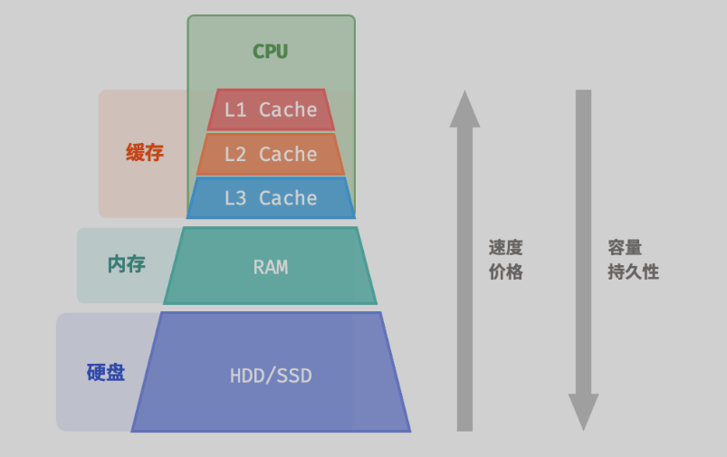

# 硬盘，内存，缓存
- 如下图所示计算机组成

## 数组和链表的内存效率
- 数组消耗更多的内存，但是空间利用率高；链表消耗的内存更少
- 内存碎片化：链表会导致内存碎片化更多
## 数组和链表的缓存效率
- 缓存命中率越少，CPU计算效率越高

实际上，数组和链表对缓存的利用效率是不同的，主要体现在以下几个方面。
- 占用空间：链表元素比数组元素占用空间更多，导致缓存中容纳的有效数据量更少。
- 缓存行：链表数据分散在内存各处，而缓存是“按行加载”的，因此加载到无效数据的比例更高。
- 预取机制：数组比链表的数据访问模式更具“可预测性”，即系统更容易猜出即将被加载的数据。
- 空间局部性：数组被存储在集中的内存空间中，因此被加载数据附近的数据更有可能即将被访问。

总体而言，数组具有更高的缓存命中率，因此它在操作效率上通常优于链表。__这使得在解决算法问题时，基于数组实现的数据结构往往更受欢迎__。

需要注意的是，高缓存效率并不意味着数组在所有情况下都优于链表。实际应用中选择哪种数据结构，应根据具体需求来决定。例如，数组和链表都可以实现“栈”数据结构（下一章会详细介绍），但它们适用于不同场景。

- __在做算法题时__，我们会倾向于选择基于数组实现的栈，因为它提供了更高的操作效率和随机访问的能力，代价仅是需要预先为数组分配一定的内存空间。
- __实践中，服务器中__：如果数据量非常大、动态性很高、栈的预期大小难以估计，那么基于链表实现的栈更加合适。链表能够将大量数据分散存储于内存的不同部分，并且避免了数组扩容产生的额外开销。